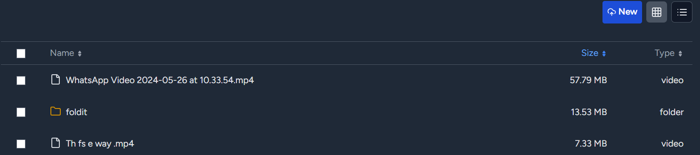
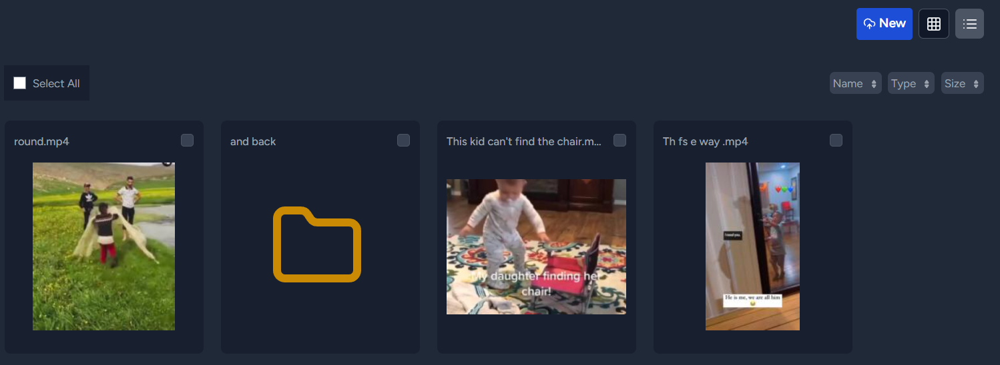

<p align="center">
  
 <h2 align="center">PERSONAL DRIVE</h2>
 <p align="center">A self hosted alternative to google drive and dropbox. 
</p>

## Why Personal Drive ? 
- Keep your data with yourself. 
- Many hosting companies provide really cheap data storage. Examples:

> buyvm.net ( + their block storage )  
hostbrr.com  
host-c.com  
novacloud-hosting.com  ( contact them )  
 
 
## Demo:
https://demo.personaldrive.xyz/


## Features:

- Share files:
  - Password protection
  - Set expiration
  - Set custom URL
  - A sharing control panel, to pause and delete existing shares
- Media player. Slideshow:
  - Play and view images and videos
  - Preview text and pdf files
  - Keyboard shortcuts available during slideshow . Left, right, escape
- Files are indexed
- Dynamically generated thumbnails
- Upload multiple files or entire folders recursively
- Select one or all files in a folder
- Download, delete, share selected files
- Two layouts: list view and tile view
- Sort based on size, type or name
- Fast sort, even for thousands of files
- Breadcrumb navigation
- Rename functionality
- Drag and Drop to Upload files and folders
- Duplicate detection and overwriting/abort option
- Edit Text Files
- Create new files

## Requirements:
- A server running PHP with sqlite, PHP composer, nodejs, npm.
- Sudo access for setting permissions.
- Webserver user name (if not www-data)
- Files for upload
- Friends to share files with

## Installation:
### Use from Docker Hub 
Personal Drive is hosted on docker hub.  Please read the following carefully, as below config will need changes for your setup.

Make a new directory, cd into it, then create a new file docker-compose.yml.
```bash
mkdir personaldrive ; cd personaldrive ; touch docker-compose.yml
```

Below is docker-compose.yml. Modify it in the following way:
- /absolute/path/to/store/data/on/host - Change to the location where you intended to save your data. **Make sure dir is writable.** In my case I had to give 777 permissions.

#### For Localhost 

```
services:
  personal-drive:
    image: docker.io/personaldrive/personaldrive
    container_name: personal-drive
    restart: unless-stopped
    ports:
      - "127.0.0.1:8080:80"
    volumes:
      - /absolute/path/to/store/data/on/host:/var/www/html/personal-drive-storage-folder
      - personal-drive-data:/var/www/html/personal-drive/database/db
    environment:
      DISABLE_HTTPS: true
volumes:
  personal-drive-data:
```
Run `docker compose up` 
Open http://localhost:8080

#### Server Instructions
- https://sub.yoursite.com - set your real site.
```
services:
  personal-drive:
    image: docker.io/personaldrive/personaldrive
    container_name: personal-drive
    restart: unless-stopped
    ports:
      - "8080:80"
    volumes:
      - /absolute/path/to/store/data/on/host:/var/www/html/personal-drive-storage-folder
      - personal-drive-data:/var/www/html/personal-drive/database/db
    environment:
      APP_URL: https://sub.yoursite.com
volumes:
  personal-drive-data:
```
Run `docker compose up`

Next we need a web-server to point to this container.
Config depends on the webserver. 
1. For **caddy**, its simple if we use reverse_proxy. It handles https automagically. Highly recommended for personal sites !
```
sub.yoursite.com {
    reverse_proxy localhost:8080
} 
```
The app will also be available on http://localhost:8080 

### Regular Installation
Clone the repo and runs the guided setup script.
```bash
 git clone https://github.com/gyaaniguy/personal-drive.git
 cd personal-drive
 chmod +x setup.sh
 ./setup.sh
```

Ensure PHP and the webserver allow large uploads.   
**It is vital that the 'storage, bootstrap/cache and database' folders are writable for the webserver** . The setup script attempts to set these permissions.

 
Next :
- Set up your webserver to point your site to personal-drive/public
- Open the site and follow the on-screen wizard to create an admin account and set up the storage folder.


## Configuration:
- Storage folder can be changed from 'Settings'
- Increasing upload limits is crucial and depends on your web server app - apache, nginx, caddy. Detailed instructions are present on the 'settings' page after app installation.
- Increasing PHP and PHP-FPM (if used) memory limits is also crucial.
- The following folders require write permissions:
```bash
storage
bootstrap/cache
database
```
The setup script adjusts permissions and ownership if provided with root access


## Forgot password: 
Admin Password cannot be changed. This is done to reduce attack surface. If you forget your password: 
- reinstall the app OR delete the `database/db/database.sqlite` file -> This will remove all 'shares'
- Manually edit the password in the above database file


## Development:
Built with Laravel 11 and React. Inertia.js connects React components to the Laravel backend. Uses SQLite as the database.
PHP code follows psr-12 standard

For local dev, you may want to disable https. Change to these in .env
```
DISABLE_HTTPS=true
APP_ENV=development

```
Then run:
```bash
php artisan cache:clear ; php artisan config:clear ; 
```


To build frontend components run `npm run build ; npm run dev`

## Troubleshooting
- Permissions are important ! I have improved error handling, so the app informs the user. But if getting unexpected errors. Please ensure important directories have write permissions.
  - data storage folder -> as set in settings. 
  - ./database folder | ./database/db/database.sqlite file
  - ./bootstrap/cache 
  - ./storage 
- Large Uploads failing: PHP upload limits are annoyingly low.  
  - Edit php.ini 
```ini
; php.ini
upload_max_filesize = 1G
post_max_size = 1G
max_file_uploads = 10000
```
  - nginx/apache can also have their own limits. Caddy just works.


## Todo:
- bug: rename folders is broken. removed
- feature: Improve PDF preview. Currently only shows one page
- feature: markdown support
- feature: More preview-able files - doc, docx, ppt. Unsure if this will be feasible.


## Screenshots:

<p align="center">
  
 <h4 align="center">List View</h4>

  
 <h4 align="center">Tile View</h4>

  
 <h2 align="center">PERSONAL DRIVE</h2>
 <p align="center">A self hosted alternative to google drive and dropbox. 
</p>
