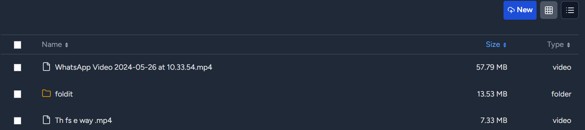
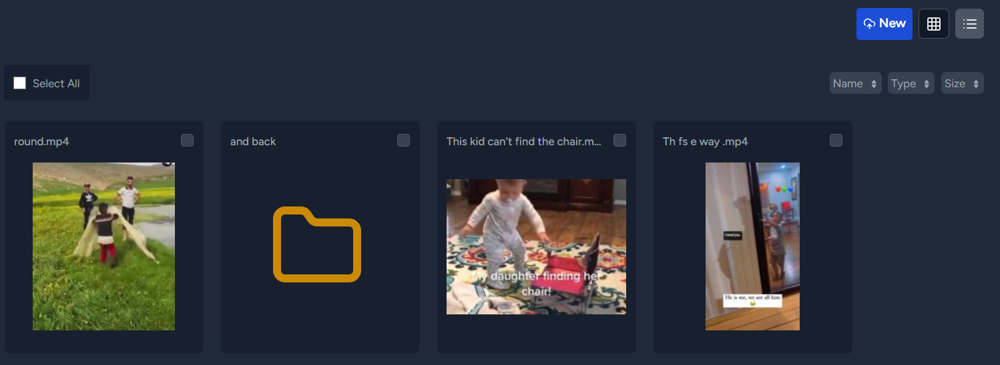

<p align="center">
  
 <h2 align="center">PERSONAL DRIVE</h2>
 <p align="center">A self-hosted alternative to Google Drive and Dropbox. 
</p>

---

## Table of Contents
- [Why Personal Drive?](#why-personal-drive)
- [Demo](#demo)
- [What's New in v2](#whats-new-in-v2)
- [Features](#features)
- [Requirements](#requirements)
- [Installation](#installation)
- [Configuration](#configuration)
- [Forgot Password](#forgot-password)
- [Development](#development)
- [Troubleshooting](#troubleshooting)
- [Todo](#todo)
- [Shelved](#shelved)
- [Screenshots](#screenshots)

---

## Why Personal Drive? 
- 🛡️ **Keep your data with yourself.**
- 💰 **Affordable hosting options:**
  - buyvm.net ( + their block storage )
  - hostbrr.com
  - host-c.com
  - novacloud-hosting.com (contact them)

---

## Demo:
🌐 [Live Demo](https://demo.personaldrive.xyz/)

---
## What's New in v2:

- 🔐 **Two Factor Authentication** — TOTP (Google Authenticator, etc.)
- 🔒 **Password-protected uploads** — client-side AES-256 encrypted zips
- 🎧 **Audiobook support** — save position + rewind controls
- ⌨️ **Go-to-folder** — Ctrl+G to jump to any folder by name
- ⭐ **Favorites** — pin files and folders for quick access
- 🌐 **Reverse proxy support** — configurable trusted proxies
- 🙈 **No-auth mode** — optional open access
- 📤 **Upload queue** — per-upload progress reporting
- 📄 **More previews** — HTML viewer, lazy-loaded image/text/PDF
- 🛡️ **Security hardening** — symlink protection, rate-limited 2FA, stronger share checks

See the [full changelog](CHANGELOG.md).

---

## Features:

- Share files:
  - Password protection
  - Set expiration
  - Set custom URL
  - A sharing control panel to pause and delete existing shares
- Media player and slideshow:
  - Play and view images, videos and audios
  - Preview text, HTML and PDF files
  - Keyboard shortcuts available during slideshow: Left, Right, Escape
  - Audiobook support, by adding rewind and save position
- Files are indexed
- Dynamically generated thumbnails
- Upload multiple files or entire folders recursively
- Upload queue with per-upload progress reporting
- Select one or all files in a folder
- Download, delete, share selected files
- Two layouts: list view and tile view
- Sort by name, date, size, or type; selected sort order is remembered
- Responsive layout for mobile devices
- Fast sort, even for thousands of files
- Breadcrumb navigation
- Go-to-folder quick navigation: press Ctrl+G, type a folder name, and jump straight to any matching folder
- Rename functionality
- Drag and drop to upload files and folders
- Duplicate detection and overwriting/abort option
- Edit text files
- Create new files
- Markdown supported
- Move files
- Favorite files and folders for quick access
- Config option to disable authentication
- Config options to run behind a http proxy (reverse proxy)
- Two Factor Authentication powered by TOTP protocol. Ex: Google Authenticator
- Password-protected file upload (client-side AES-256 encrypted zip)

---

## Requirements:
- 🖥️ A server running PHP with SQLite, PHP Composer, Node.js, npm.
- 🔑 Sudo access for setting permissions.
- 👤 Webserver username (if not www-data)
- 📁 Files for upload
- 👥 Friends to share files with (Optional)

---

## Installation:
### Use from Docker Hub 
Personal Drive is hosted on Docker Hub. Please read the following carefully, as the below config will need changes for your setup.

Make a new directory, cd into it, then create a new file docker-compose.yml.
```bash
mkdir personaldrive ; cd personaldrive ; touch docker-compose.yml
```

Below is docker-compose.yml. Modify it in the following way:
- `/absolute/path/to/store/data/on/host` - Change to the location where you intend to save your data. **Make sure the directory is writable.** In my case, I had to give 777 permissions.

#### For Localhost 

```yaml
services:
  personal-drive:
    image: docker.io/personaldrive/personaldrive
    container_name: personal-drive
    restart: unless-stopped
    ports:
      - "127.0.0.1:8080:80"
    volumes:
      - /absolute/path/to/store/data/on/host:/var/www/html/personal-drive-storage-folder
      - personal-drive-data:/var/www/html/personal-drive/database/db
    environment:
      DISABLE_HTTPS: true
volumes:
  personal-drive-data:
```
Run `docker compose up` 
Open http://localhost:8080

#### Server Instructions
- https://sub.yoursite.com - set your real site.
```
services:
  personal-drive:
    image: docker.io/personaldrive/personaldrive
    container_name: personal-drive
    restart: unless-stopped
    ports:
      - "8080:80"
    volumes:
      - /absolute/path/to/store/data/on/host:/var/www/html/personal-drive-storage-folder
      - personal-drive-data:/var/www/html/personal-drive/database/db
    environment:
      APP_URL: https://sub.yoursite.com
volumes:
  personal-drive-data:
```
Run `docker compose up`

Next, we need a web server to point to this container.
Config depends on the web server. 
1. For **Caddy**, it's simple if we use reverse_proxy. It handles HTTPS automagically. Highly recommended for personal sites!
```caddy
sub.yoursite.com {
    reverse_proxy localhost:8080
} 
```
The app will also be available on http://localhost:8080

### Regular Installation
Clone the repo and run the guided setup script.
```bash
 git clone https://github.com/gyaaniguy/personal-drive.git
 cd personal-drive
 chmod +x setup.sh
 ./setup.sh
```

Ensure PHP and the web server allow large uploads.   
**It is vital that the `storage`, `bootstrap/cache`, and `database` folders are writable for the web server**. The setup script attempts to set these permissions.

---

## Configuration:
- ⚙️ The storage folder can be changed from 'Settings'
- 📈 Increasing upload limits is crucial and depends on your web server app - Apache, Nginx, Caddy. Detailed instructions are present on the 'Settings' page after app installation.
- 🧠 Increasing PHP and PHP-FPM (if used) memory limits is also crucial.
- 📝 The following folders require write permissions:
```bash
storage
bootstrap/cache
database
```
The setup script adjusts permissions and ownership if provided with root access.

### Running Behind Reverse proxy

To run behind a Http proxy, configure to allow trusted headers and specify the ips to trust. This typically refers to the headers sent by your proxy server and the ip on which it is running.

1. `TRUSTED_PROXIES=*` - to trust all ips. add to .env file in root of the directory. OR `TRUSTED_PROXIES=some.ip,ano.ther.ip` 
2. Optionally adjust headers to trust via `TRUSTED_HEADERS` in .env

### Disable Authentication, login.

Your application will be accessible by anyone without any credentials
 !!! BE CAREFUL WITH THIS !!!   

After setup, add `DISABLE_AUTH=true` to .env to disable login.  

> Only use this option if you know what you are doing
> 'create account' on setup will still be required

---

## Forgot Password: 
The admin password cannot be changed. This is done to reduce the attack surface. If you forget your password: 
- Reinstall the app OR delete the `database/db/database.sqlite` file -> This will remove all 'shares'
- Manually edit the password in the above database file

---

## Development:
Built with Laravel 11 and React. Inertia.js connects React components to the Laravel backend. Uses SQLite as the database.
PHP code follows PSR-12 standard.

### Extensive Testing. 

Tests cover various scenarios and branches. Live coverage:


### Running the checks

`./check.sh` runs everything locally - phpcs (PSR-12), phpstan, Pest, eslint, JS tests, and an install smoke test. 
CI: The pre-push hook in `.githooks/pre-push` runs it before every push; bypass once with `git push --no-verify`.

### Test installation scripts

`tests/install/smoke.sh` proves a fresh install still produces a working app. Needs Docker.

```bash
./tests/install/smoke.sh          # regular install: runs setup.sh as a non-root
                                  # user in a bare container, serves it with
                                  # Apache as www-data, creates the admin
                                  # account over HTTP, then re-runs setup.sh
                                  # to confirm a second run is harmless
./tests/install/smoke.sh docker   # builds this repo's Dockerfile, runs it with
                                  # the volumes from the instructions above, and
                                  # restarts it to confirm data survives
```

The regular-install mode is part of `check.sh`. Docker mode is manual - it rebuilds the image and takes a few minutes.

For local development, you may want to disable HTTPS. Change these in `.env`:
```env
DISABLE_HTTPS=true
APP_ENV=development
```
Then run:
```bash
php artisan cache:clear ; php artisan config:clear ; 
```

To build frontend components, run `npm run build ; npm run dev`

---

## Troubleshooting
- ⚠️ **Permissions are important!** I have improved error handling, so the app informs the user. But if you are getting unexpected errors, please ensure important directories have write permissions.
  - Data storage folder -> as set in settings. 
  - `./database` folder | `./database/db/database.sqlite` file
  - `./bootstrap/cache` 
  - `./storage` 
- 🛠️ **Large uploads failing:** PHP upload limits are annoyingly low.  
  - Edit `php.ini` 
```ini
; php.ini
upload_max_filesize = 1G
post_max_size = 1G
max_file_uploads = 10000
```
  - Nginx/Apache can also have their own limits. Caddy just works.

---

## Todo:

#### Future Plans
These are just thoughts. Can't make any promises.
- Feature: Improve search. Maybe in-content search, folder-specific. Maybe a special 'Notes' mode
- Feature: Collaboration. Perhaps a checkbox that allows guests to upload?

---

## Shelved:
Features we looked into but appear unfeasible. Not on the roadmap for now.
- Encryption: full at-rest encryption so the host can't read your files. Partially done - Upload files as client-side encrypted zips.
- More previewable files - doc, docx, ppt.

---

## Screenshots:

<p align="center">
  
 <h4 align="center">List View</h4>

  
 <h4 align="center">Tile View</h4>

  
</p>
